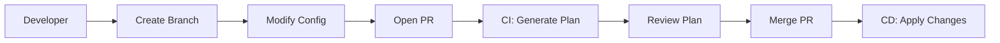

# CI/CD Integration Guide

This guide demonstrates how to integrate kongctl declarative configuration into 
your CI/CD pipelines for automated API infrastructure management.

## Table of Contents

- [Overview](#overview)
- [GitHub Actions](#github-actions)
- [GitLab CI](#gitlab-ci)
- [Jenkins](#jenkins)
- [Security Considerations](#security-considerations)
- [Advanced Patterns](#advanced-patterns)

## Overview

### Key Principles

1. **Plan on PR**: Generate and review plans in pull requests
2. **Apply on Merge**: Automatically apply changes to main branch
3. **Environment Separation**: Different configs for dev/staging/prod
4. **Approval Gates**: Require human approval for production
5. **Rollback Capability**: Keep plans for quick rollback

### Typical Workflow



## Plan Artifacts in CI/CD

Plan artifacts optional, but can be useful for CI/CD workflows. A plan file enables separation 
between planning and execution, allowing for additional review and approval processes of changes.

### Benefits of Plan Artifacts

1. **Predictability**: Know exactly what will change before execution
2. **Auditability**: Store plans as build artifacts for compliance
3. **Approval Workflows**: Review plans before applying to production
4. **Rollback Safety**: Keep previous plans for quick recovery
5. **Cross-Team Collaboration**: Share plans for review and feedback

### Plan Artifact Storage Strategies

#### Short-term Storage (CI Artifacts)
```yaml
# Store as CI build artifact
- name: Upload Plan
  uses: actions/upload-artifact@v3
  with:
    name: kong-plan-${{ github.sha }}
    path: plan.json
    retention-days: 30
```

#### Long-term Storage (Version Control)

Commit plans alongside configurations:
```shell
plans/
├── 2024-01-15-add-user-api.json
├── 2024-01-16-update-rate-limits.json
└── 2024-01-17-emergency-rollback.json
```

#### External Storage (S3, GCS, etc.)

Upload to S3 for long-term retention:
```shell
aws s3 cp plan.json s3://kong-plans/$(date +%Y/%m/%d)/plan-${BUILD_ID}.json
```

### Plan Review Best Practices

1. **Always generate diffs from plans** for human review:
   ```shell
   kongctl diff --plan plan.json
   ```

2. **Include plan summary in PR comments** for visibility

3. **Validate plans before storing** to ensure they're valid:
   ```shell
   kongctl apply --plan plan.json --dry-run
   ```

4. **Tag plans with metadata** for easier tracking:
   - Commit SHA
   - Timestamp
   - Author
   - Environment

## GitHub Actions

### Basic Workflow

```yaml
# .github/workflows/kong-config.yml
name: Kong Configuration Management

on:
  pull_request:
    paths:
      - 'kong-config/**'
  push:
    branches:
      - main
    paths:
      - 'kong-config/**'

jobs:
  plan:
    name: Plan Changes
    runs-on: ubuntu-latest
    if: github.event_name == 'pull_request'
    
    steps:
      - uses: actions/checkout@v3
      
      - name: Install kongctl
        run: |
          curl -sL https://github.com/Kong/kongctl/releases/latest/download/kongctl_linux_amd64.tar.gz | tar xz
          sudo mv kongctl /usr/local/bin/
      
      - name: Generate Plan
        env:
          KONGCTL_KONNECT_PAT: ${{ secrets.KONG_PAT }}
        run: |
          kongctl plan -f kong-config/ --output-file plan.json
          
      - name: Comment PR with Plan
        uses: actions/github-script@v6
        with:
          script: |
            const fs = require('fs');
            const plan = JSON.parse(fs.readFileSync('plan.json', 'utf8'));
            
            const comment = `## Kong Configuration Changes
            
            **Summary:**
            - Create: ${plan.summary.create} resources
            - Update: ${plan.summary.update} resources
            - Delete: ${plan.summary.delete} resources
            
            <details>
            <summary>View Detailed Plan</summary>
            
            \`\`\`json
            ${JSON.stringify(plan.changes, null, 2)}
            \`\`\`
            
            </details>`;
            
            github.rest.issues.createComment({
              issue_number: context.issue.number,
              owner: context.repo.owner,
              repo: context.repo.repo,
              body: comment
            });

  apply:
    name: Apply Changes
    runs-on: ubuntu-latest
    if: github.ref == 'refs/heads/main' && github.event_name == 'push'
    
    steps:
      - uses: actions/checkout@v3
      
      - name: Install kongctl
        run: |
          curl -sL https://github.com/Kong/kongctl/releases/latest/download/kongctl_linux_amd64.tar.gz | tar xz
          sudo mv kongctl /usr/local/bin/
      
      - name: Apply Configuration
        env:
          KONGCTL_KONNECT_PAT: ${{ secrets.KONG_PAT }}
        run: |
          kongctl apply -f kong-config/ --auto-approve
```

### Multi-Environment Workflow

```yaml
# .github/workflows/kong-environments.yml
name: Kong Multi-Environment Deployment

on:
  push:
    branches:
      - main
      - staging
      - develop

jobs:
  deploy:
    runs-on: ubuntu-latest
    
    steps:
      - uses: actions/checkout@v3
      
      - name: Determine Environment
        id: env
        run: |
          if [ "${{ github.ref }}" == "refs/heads/main" ]; then
            echo "environment=production" >> $GITHUB_OUTPUT
            echo "profile=prod" >> $GITHUB_OUTPUT
          elif [ "${{ github.ref }}" == "refs/heads/staging" ]; then
            echo "environment=staging" >> $GITHUB_OUTPUT
            echo "profile=staging" >> $GITHUB_OUTPUT
          else
            echo "environment=development" >> $GITHUB_OUTPUT
            echo "profile=dev" >> $GITHUB_OUTPUT
          fi
      
      - name: Install kongctl
        run: |
          curl -sL https://github.com/Kong/kongctl/releases/latest/download/kongctl_linux_amd64.tar.gz | tar xz
          sudo mv kongctl /usr/local/bin/
      
      - name: Apply Configuration
        env:
          KONGCTL_KONNECT_PAT: ${{ secrets[format('KONG_PAT_{0}', steps.env.outputs.environment)] }}
        run: |
          kongctl apply \
            -f kong-config/base/ \
            -f kong-config/${{ steps.env.outputs.environment }}/ \
            --profile ${{ steps.env.outputs.profile }} \
            --auto-approve
```

## GitLab CI

### Basic Pipeline

```yaml
# .gitlab-ci.yml
stages:
  - validate
  - plan
  - apply

variables:
  KONG_CONFIG_PATH: "kong-config"

.install_kongctl: &install_kongctl
  - curl -sL https://github.com/Kong/kongctl/releases/latest/download/kongctl_linux_amd64.tar.gz | tar xz
  - mv kongctl /usr/local/bin/

validate:
  stage: validate
  script:
    - *install_kongctl
    - kongctl plan -f $KONG_CONFIG_PATH
  only:
    - merge_requests

plan:
  stage: plan
  script:
    - *install_kongctl
    - kongctl plan -f $KONG_CONFIG_PATH --output-file plan.json
    - kongctl diff --plan plan.json
  artifacts:
    paths:
      - plan.json
    reports:
      dotenv: plan.env
  only:
    - merge_requests

apply:
  stage: apply
  script:
    - *install_kongctl
    - kongctl apply -f $KONG_CONFIG_PATH --auto-approve
  only:
    - main
```

### Advanced GitLab Pipeline with Environments

```yaml
# .gitlab-ci.yml
stages:
  - plan
  - review
  - deploy

.kong_job:
  image: ubuntu:latest
  before_script:
    - apt-get update && apt-get install -y curl
    - curl -sL https://github.com/Kong/kongctl/releases/latest/download/kongctl_linux_amd64.tar.gz | tar xz
    - mv kongctl /usr/local/bin/

plan:development:
  extends: .kong_job
  stage: plan
  script:
    - kongctl plan -f kong-config/dev/ --output-file plan-dev.json
  artifacts:
    paths:
      - plan-dev.json
  only:
    - merge_requests

plan:production:
  extends: .kong_job
  stage: plan
  script:
    - kongctl plan -f kong-config/prod/ --output-file plan-prod.json
  artifacts:
    paths:
      - plan-prod.json
  only:
    - merge_requests

review:plan:
  stage: review
  script:
    - echo "Review plans in artifacts"
  dependencies:
    - plan:development
    - plan:production
  only:
    - merge_requests

deploy:development:
  extends: .kong_job
  stage: deploy
  environment:
    name: development
  script:
    - kongctl apply -f kong-config/dev/ --auto-approve
  only:
    - develop

deploy:production:
  extends: .kong_job
  stage: deploy
  environment:
    name: production
  script:
    - kongctl apply -f kong-config/prod/ --auto-approve
  when: manual
  only:
    - main
```

## Jenkins

### Declarative Pipeline

```groovy
// Jenkinsfile
pipeline {
    agent any
    
    environment {
        KONGCTL_VERSION = 'latest'
        KONG_CONFIG_PATH = 'kong-config'
    }
    
    stages {
        stage('Setup') {
            steps {
                sh '''
                    curl -sL https://github.com/Kong/kongctl/releases/${KONGCTL_VERSION}/download/kongctl_linux_amd64.tar.gz | tar xz
                    mv kongctl /usr/local/bin/
                '''
            }
        }
        
        stage('Plan') {
            when {
                changeRequest()
            }
            steps {
                withCredentials([string(credentialsId: 'kong-pat', variable: 'KONGCTL_KONNECT_PAT')]) {
                    sh 'kongctl plan -f ${KONG_CONFIG_PATH} --output-file plan.json'
                    sh 'kongctl diff --plan plan.json'
                    
                    publishHTML([
                        allowMissing: false,
                        alwaysLinkToLastBuild: true,
                        keepAll: true,
                        reportDir: '.',
                        reportFiles: 'plan.json',
                        reportName: 'Kong Plan'
                    ])
                }
            }
        }
        
        stage('Apply') {
            when {
                branch 'main'
            }
            steps {
                withCredentials([string(credentialsId: 'kong-pat', variable: 'KONGCTL_KONNECT_PAT')]) {
                    sh 'kongctl apply -f ${KONG_CONFIG_PATH} --auto-approve'
                }
            }
        }
    }
    
    post {
        always {
            cleanWs()
        }
    }
}
```

### Scripted Pipeline with Approval

```groovy
// Jenkinsfile
node {
    def kongctl = tool name: 'kongctl', type: 'com.cloudbees.jenkins.plugins.customtools.CustomTool'
    
    stage('Checkout') {
        checkout scm
    }
    
    stage('Plan') {
        withCredentials([string(credentialsId: 'kong-pat-dev', variable: 'KONGCTL_KONNECT_PAT')]) {
            sh "${kongctl}/kongctl plan -f kong-config/ --output-file plan.json"
            
            def plan = readJSON file: 'plan.json'
            echo "Changes: ${plan.summary.create} creates, ${plan.summary.update} updates, ${plan.summary.delete} deletes"
            
            archiveArtifacts artifacts: 'plan.json'
        }
    }
    
    if (env.BRANCH_NAME == 'main') {
        stage('Approval') {
            timeout(time: 1, unit: 'HOURS') {
                input message: 'Approve Kong configuration changes?', ok: 'Deploy'
            }
        }
        
        stage('Apply') {
            withCredentials([string(credentialsId: 'kong-pat-prod', variable: 'KONGCTL_KONNECT_PAT')]) {
                sh "${kongctl}/kongctl apply --plan plan.json --auto-approve"
            }
        }
    }
}
```

## Security Considerations

### 1. Credential Management

**Never commit credentials to version control!**

```yaml
# BAD - Never do this
apis:
  - ref: my-api
    name: "My API"
    auth_key: "sk-1234567890abcdef"  # NEVER!

# GOOD - Use environment variables
apis:
  - ref: my-api
    name: "My API"
    auth_key: ${API_AUTH_KEY}
```

### 2. Least Privilege Access

Create separate PATs for each environment:

Development PAT with read/write to dev resources:
```bash
KONG_PAT_DEV="kpat_dev_xxxxx"
```

Production PAT with read/write to prod resources (requires 2FA):
```bash
KONG_PAT_PROD="kpat_prod_xxxxx"
```

### 3. Audit Trail

Keep all plans for audit purposes:

```yaml
# GitHub Actions example
- name: Archive Plan
  uses: actions/upload-artifact@v3
  with:
    name: kong-plan-${{ github.sha }}
    path: plan.json
    retention-days: 90
```

### 4. Protected Resources

Mark critical resources as protected:

```yaml
apis:
  - ref: payment-api
    name: "Payment Processing API"
    kongctl:
      protected: true
      namespace: production
```

Note: The `protected: true` flag prevents accidental changes through kongctl operations.

## Advanced Patterns

### 1. Blue-Green Deployments

```yaml
# blue-green.yml
name: Blue-Green Deployment

on:
  workflow_dispatch:
    inputs:
      target:
        description: 'Deploy to blue or green'
        required: true
        type: choice
        options:
          - blue
          - green

jobs:
  deploy:
    runs-on: ubuntu-latest
    steps:
      - uses: actions/checkout@v3
      
      - name: Deploy to ${{ inputs.target }}
        env:
          KONGCTL_KONNECT_PAT: ${{ secrets.KONG_PAT }}
        run: |
          kongctl apply \
            -f kong-config/base/ \
            -f kong-config/${{ inputs.target }}/ \
            --auto-approve
```

### 2. Canary Deployments

Create a canary deployment script:

```bash
#!/bin/bash
```

Filename: canary-deploy.sh

Deploy canary configuration:
```bash
kongctl apply -f configs/canary/ \
  --auto-approve
```

Monitor metrics for 5 minutes:
```bash
sleep 300
```

Check error rate and decide on deployment:
```bash
ERROR_RATE=$(curl -s metrics.example.com/error_rate)
if [ "$ERROR_RATE" -lt "0.01" ]; then
  kongctl apply -f configs/production/ \
    --auto-approve
else
  kongctl sync -f configs/canary-stable/ \
    --auto-approve
  exit 1
fi
```

### 3. Drift Detection

```yaml
# .github/workflows/drift-detection.yml
name: Drift Detection

on:
  schedule:
    - cron: '0 */6 * * *'  # Every 6 hours

jobs:
  detect-drift:
    runs-on: ubuntu-latest
    steps:
      - uses: actions/checkout@v3
      
      - name: Check for Drift
        env:
          KONGCTL_KONNECT_PAT: ${{ secrets.KONG_PAT }}
        run: |
          kongctl diff -f kong-config/ --format json > drift.json
          
          if [ -s drift.json ]; then
            echo "Drift detected!"
            curl -X POST ${{ secrets.SLACK_WEBHOOK }} \
              -d '{"text":"Kong configuration drift detected"}'
          fi
```

### 4. Multi-Region Deployment

```yaml
# deploy-multi-region.yml
jobs:
  deploy:
    strategy:
      matrix:
        region: [us-east, us-west, eu-central, ap-south]
    runs-on: ubuntu-latest
    steps:
      - uses: actions/checkout@v3
      
      - name: Deploy to ${{ matrix.region }}
        env:
          KONGCTL_KONNECT_PAT: ${{ secrets[format('KONG_PAT_{0}', matrix.region)] }}
        run: |
          kongctl apply \
            -f kong-config/global/ \
            -f kong-config/${{ matrix.region }}/ \
            --profile ${{ matrix.region }} \
            --auto-approve
```

## Best Practices

1. **Version Control Everything**: Include all configuration files
2. **Review All Changes**: Use PR reviews for configuration changes
3. **Test First**: Always test in non-production environments
4. **Automate Rollback**: Keep previous configurations for quick rollback
5. **Monitor Deployments**: Track success/failure of deployments
6. **Use Namespaces**: Isolate different environments/teams
7. **Implement Gradual Rollout**: Deploy to subset first
8. **Maintain Audit Trail**: Archive all plans and apply results

## Troubleshooting CI/CD

### Common Issues

1. **Authentication Failures**
   - Verify PAT is not expired
   - Check environment variable names
   - Ensure proper credential storage

2. **Plan Generation Failures**
   - Validate YAML syntax
   - Check file paths are correct
   - Verify network connectivity

3. **Apply Failures**
   - Review plan for conflicts
   - Check for protected resources
   - Verify dependencies exist

### Debug Mode

Enable verbose logging in CI:

```bash
export KONGCTL_LOG_LEVEL=debug
kongctl apply -f configs/ --auto-approve
```

## Further Reading

- [Declarative Configuration Guide](../declarative-configuration.md)
- [Troubleshooting Guide](../troubleshooting.md)
- [Example Configurations](examples/declarative/)
