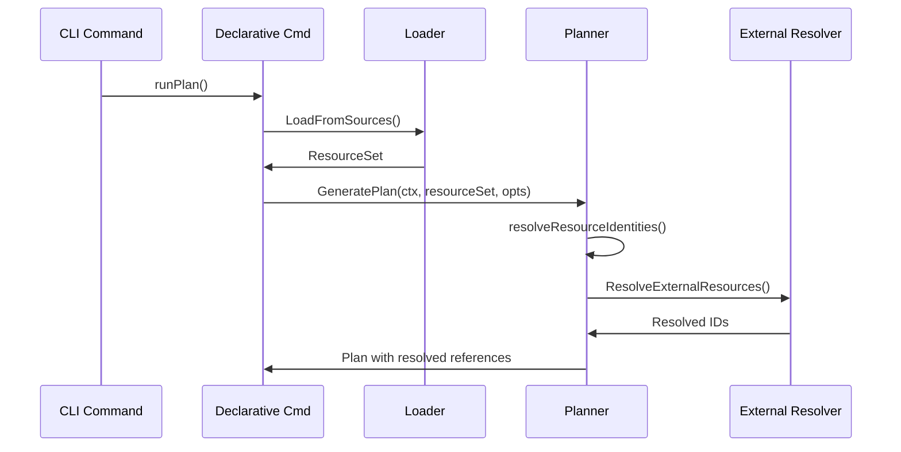
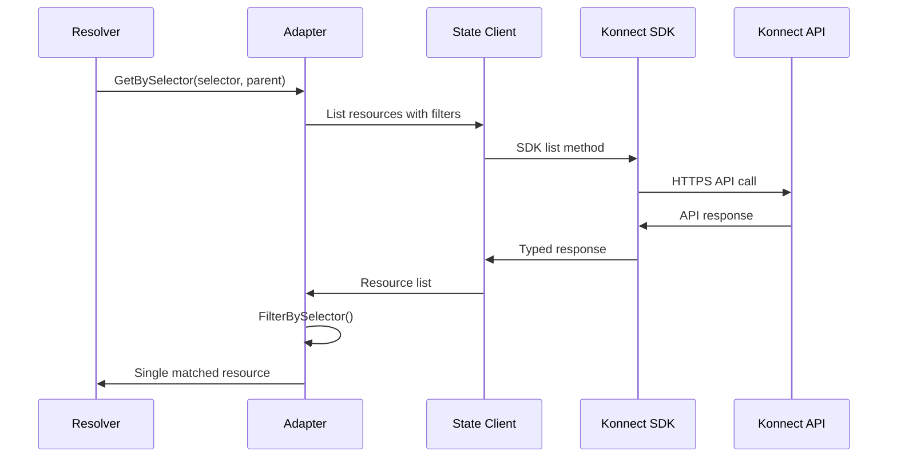
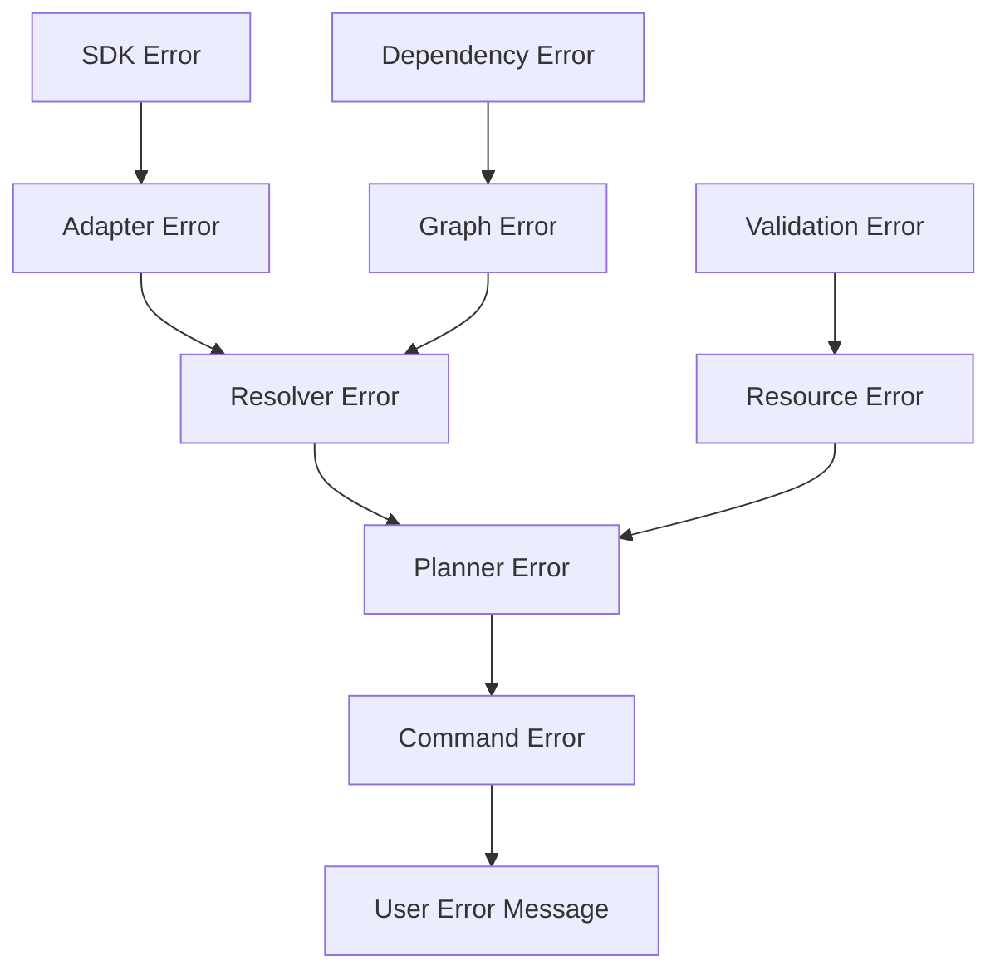

# External Resources Code Flow Analysis Report

**Analysis Date**: 2025-08-08  
**Current Branch**: feat/008-external-resources  
**Scope**: Complete execution flow mapping for external resource resolution

## Executive Summary

This report maps the complete code execution flow for external resource resolution in kongctl, from command entry points through to SDK integration. The analysis covers the data flow through 6 major system components with detailed execution paths, error handling flows, and integration points.

## System Architecture Overview

The external resources system consists of 6 core components working together:

```
┌─────────────────┐    ┌──────────────────┐    ┌─────────────────────┐
│   CLI Commands  │───▶│     Planner      │───▶│ External Resolver   │
│ (Plan/Sync/Apply)│    │                  │    │                     │
└─────────────────┘    └──────────────────┘    └─────────────────────┘
                                                           │
                                                           ▼
┌─────────────────┐    ┌──────────────────┐    ┌─────────────────────┐
│  State Client   │◀───│    Adapters      │◀───│    Registry         │
│   (SDK Ops)     │    │  (Base + Conc.)  │    │  (Resource Types)   │
└─────────────────┘    └──────────────────┘    └─────────────────────┘
```

## 1. Command Entry Points Flow

### 1.1 Plan Command Flow

**Entry Point**: `/internal/cmd/root/verbs/plan/plan.go:78`

```go
// Flow: Plan Command → Konnect Command → Declarative Command
func runPlan(command *cobra.Command, args []string) error {
    // Plan command delegates to konnect command using "Konnect-first" pattern
    return konnectCmd.RunE(command, args)
}
```

**Key File**: `/internal/cmd/root/products/konnect/declarative/declarative.go`



### 1.2 Sync/Apply Command Flow

**Similar Pattern**: Both follow the same entry flow but with different planner modes:
- **Sync Mode**: `planner.PlanModeSync` (allows DELETE operations)  
- **Apply Mode**: `planner.PlanModeApply` (no DELETE operations)

**Execution Path**:
```
Command → Konnect → Declarative → Planner.GeneratePlan() → External Resolution
```

## 2. Resource Loading and Parsing Flow

### 2.1 Configuration Loading

**Entry Point**: `/internal/cmd/root/products/konnect/declarative/declarative.go:125`

```go
// Parse sources from filenames
sources, err := loader.ParseSources(filenames)

// Load configuration
ldr := loader.New()
resourceSet, err := ldr.LoadFromSources(sources, recursive)
```

**Data Flow**:
1. **File Discovery**: Parse filenames/directories 
2. **YAML Loading**: Load and validate configuration files
3. **Resource Set Creation**: Aggregate all resources into ResourceSet
4. **Schema Validation**: Validate external resource configurations

### 2.2 External Resource Schema Validation

**Location**: `/internal/declarative/resources/external_resource.go:47`

```go
func (e ExternalResourceResource) Validate() error {
    // XOR validation: either ID or selector, not both
    if (e.ID != nil && *e.ID != "") && e.Selector != nil {
        return fmt.Errorf("external resource cannot have both ID and selector")
    }
    
    // Resource type validation
    registry := external.GetResolutionRegistry()
    if !registry.IsSupported(e.ResourceType) {
        return fmt.Errorf("unsupported resource type: %s", e.ResourceType)
    }
    
    // Parent validation
    if e.Parent != nil {
        return e.validateParent()
    }
    return nil
}
```

## 3. Planner Integration Flow

### 3.1 Planning Phase Entry

**Entry Point**: `/internal/declarative/planner/planner.go:397`

```go
func (p *Planner) resolveResourceIdentities(ctx context.Context, rs *resources.ResourceSet) error {
    // STEP 1: Resolve external resources FIRST - they may be referenced by others
    externalResources := make([]external.Resource, len(rs.ExternalResources))
    for i := range rs.ExternalResources {
        externalResources[i] = &rs.ExternalResources[i]
    }
    
    if err := p.externalResolver.ResolveExternalResources(ctx, externalResources); err != nil {
        return fmt.Errorf("failed to resolve external resources: %w", err)
    }
    
    // STEP 2: Resolve other resource identities (APIs, Portals, etc.)
    // ...
}
```

### 3.2 Planner Architecture

**Key Component**: External resources are resolved **before** all other resources because they may be referenced by regular resources.

**Resolution Order**:
1. ✅ **External Resources** (via dependency graph)
2. ✅ **API Identities** 
3. ✅ **Portal Identities**
4. ✅ **Auth Strategy Identities**
5. ✅ **Child Resources** (via parent APIs/Portals)

## 4. External Resource Resolution Flow

### 4.1 Main Resolution Entry Point

**File**: `/internal/declarative/external/resolver.go:34`

```go
func (r *ResourceResolver) ResolveExternalResources(
    ctx context.Context,
    externalResources []Resource,
) error {
    // STEP 1: Build dependency graph for resolution ordering
    graph, err := r.buildDependencyGraph(externalResources)
    if err != nil {
        return fmt.Errorf("failed to build dependency graph: %w", err)
    }

    // STEP 2: Resolve resources in dependency order
    for _, ref := range graph.ResolutionOrder {
        resource := findResourceByRef(externalResources, ref)
        if err := r.resolveResource(ctx, resource); err != nil {
            return fmt.Errorf("failed to resolve external resource %q: %w", ref, err)
        }
    }
    
    return nil
}
```

### 4.2 Single Resource Resolution Flow

**Method**: `resolveResource(ctx, resource)` at `/internal/declarative/external/resolver.go:67`

```mermaid
flowchart TD
    A[resolveResource] --> B{Already Resolved?}
    B -->|Yes| Z[Skip - Return]
    B -->|No| C[Get Registry Adapter]
    C --> D{Has Parent?}
    D -->|Yes| E[Resolve Parent Context]
    D -->|No| F{Resolution Type?}
    E --> F
    F -->|ID| G[adapter.GetByID()]
    F -->|Selector| H[adapter.GetBySelector()]
    G --> I[Store Resolved Resource]
    H --> J{Match Count?}
    J -->|0| K[createZeroMatchError]
    J -->|1| I
    J -->|>1| L[createMultipleMatchError]
    I --> M[Update Original Resource]
    M --> N[Log Success]
    K --> X[Return Error]
    L --> X
```

### 4.3 Resolution Data Flow

**Input**: External resource configuration  
**Processing**: Adapter-based SDK calls  
**Output**: Resolved Konnect ID and cached resource object

```go
// Input: External resource with selector or ID
{
    "ref": "my-portal",
    "resource_type": "portal",
    "selector": {"name": "Dev Portal"}
}

// Output: Resolved resource with Konnect ID
resolvedResource := &ResolvedResource{
    ID:           "f47ac10b-58cc-4372-a567-0e02b2c3d479", // From Konnect
    Resource:     portalObject,                            // Full SDK response
    ResourceType: "portal",
    Ref:          "my-portal",
    ResolvedAt:   time.Now(),
}
```

## 5. Dependency Graph Construction

### 5.1 Graph Building Algorithm

**File**: `/internal/declarative/external/dependencies.go:8`

```go
func (r *ResourceResolver) buildDependencyGraph(externalResources []Resource) (*DependencyGraph, error) {
    // PHASE 1: Create nodes for all resources
    for _, resource := range externalResources {
        node := &DependencyNode{
            Ref:          resource.GetRef(),
            ResourceType: resource.GetResourceType(),
            ChildRefs:    make([]string, 0),
            Resolved:     false,
        }
        // Set parent reference if applicable
        parent := resource.GetParent()
        if parent != nil && parent.GetRef() != "" {
            node.ParentRef = parent.GetRef()
        }
        graph.Nodes[resource.GetRef()] = node
    }

    // PHASE 2: Build parent-child relationships and validate
    // PHASE 3: Perform topological sort (Kahn's algorithm)
}
```

### 5.2 Topological Sorting

**Algorithm**: Kahn's Algorithm for dependency-ordered resolution

```go
func (r *ResourceResolver) topologicalSort(graph *DependencyGraph) ([]string, error) {
    // Calculate in-degrees (number of dependencies)
    inDegree := make(map[string]int)
    
    // Start with nodes that have no dependencies
    queue := make([]string, 0)
    for ref, degree := range inDegree {
        if degree == 0 {
            queue = append(queue, ref)
        }
    }
    
    // Process queue and update child dependencies
    result := make([]string, 0, len(graph.Nodes))
    for len(queue) > 0 {
        current := queue[0]
        queue = queue[1:]
        result = append(result, current)
        
        // Update dependencies for child nodes
        node := graph.Nodes[current]
        for _, childRef := range node.ChildRefs {
            inDegree[childRef]--
            if inDegree[childRef] == 0 {
                queue = append(queue, childRef)
            }
        }
    }
    
    // Detect circular dependencies
    if len(result) != len(graph.Nodes) {
        return nil, fmt.Errorf("circular dependency detected")
    }
    
    return result, nil
}
```

**Resolution Order Example**:
```
1. portal-prod (no parent)
2. portal-customization (parent: portal-prod) 
3. api-users (no parent)
4. api-version-v1 (parent: api-users)
```

## 6. Registry and Adapter System Flow

### 6.1 Registry Architecture

**File**: `/internal/declarative/external/registry.go:8`

**Registry Pattern**: Singleton registry with thread-safe access

```go
// Registry manages 13 resource types with metadata
var registry *ResolutionRegistry

func GetResolutionRegistry() *ResolutionRegistry {
    registryOnce.Do(func() {
        registry = &ResolutionRegistry{
            types: make(map[string]*ResolutionMetadata),
        }
        registry.initializeBuiltinTypes()
    })
    return registry
}
```

### 6.2 Resource Type Metadata

**Supported Resource Types** (13 total):
- **Top-level**: portal, api, control_plane, application_auth_strategy
- **Portal children**: portal_customization, portal_custom_domain, portal_page, portal_snippet
- **API children**: api_version, api_publication, api_implementation, api_document  
- **Control Plane children**: ce_service

**Metadata Structure**:
```go
type ResolutionMetadata struct {
    Name              string                // Human-readable name
    SelectorFields    []string             // Supported selector fields
    SupportedParents  []string             // Valid parent types
    SupportedChildren []string             // Valid child types
    ResolutionAdapter ResolutionAdapter    // SDK integration adapter
}
```

### 6.3 Adapter Resolution Flow

**Registry Lookup**: `/internal/declarative/external/registry.go:88`

```go
func (r *ResolutionRegistry) GetResolutionAdapter(resourceType string) (ResolutionAdapter, error) {
    r.mu.RLock()
    defer r.mu.RUnlock()
    
    info, exists := r.types[resourceType]
    if !exists {
        return nil, fmt.Errorf("unsupported resource type: %s", resourceType)
    }
    
    if info.ResolutionAdapter == nil {
        return nil, fmt.Errorf("no resolution adapter configured for resource type: %s", resourceType)
    }
    
    return info.ResolutionAdapter, nil
}
```

## 7. Adapter Implementation Flow

### 7.1 Base Adapter Pattern

**File**: `/internal/declarative/external/adapters/base_adapter.go:10`

```go
type BaseAdapter struct {
    client *state.Client  // SDK operations client
}

// Common functionality for all adapters
func (b *BaseAdapter) FilterBySelector(resources []interface{}, selector map[string]string, 
    getField func(interface{}, string) string) (interface{}, error) {
    
    var matches []interface{}
    for _, resource := range resources {
        match := true
        for field, value := range selector {
            if getField(resource, field) != value {
                match = false
                break
            }
        }
        if match {
            matches = append(matches, resource)
        }
    }
    
    // Validate exactly one match
    if len(matches) == 0 {
        return nil, fmt.Errorf("no resources found matching selector: %v", selector)
    }
    if len(matches) > 1 {
        return nil, fmt.Errorf("selector matched %d resources, expected 1: %v", len(matches), selector)
    }
    
    return matches[0], nil
}
```

### 7.2 Adapter Interface Contract

**Interface**: `/internal/declarative/external/types.go:26`

```go
type ResolutionAdapter interface {
    // GetByID retrieves a resource by its Konnect ID
    GetByID(ctx context.Context, id string, parent *ResolvedParent) (interface{}, error)
    
    // GetBySelector retrieves resources matching selector criteria
    GetBySelector(ctx context.Context, selector map[string]string, parent *ResolvedParent) ([]interface{}, error)
}
```

**Concrete Adapters**: Each resource type has its own adapter implementation (13 adapters total) that extends BaseAdapter and implements SDK-specific operations.

## 8. State Client Integration Flow

### 8.1 SDK Operations Bridge

**Client Creation**: `/internal/cmd/root/products/konnect/declarative/declarative.go:168`

```go
// Create state client with Konnect SDK
stateClient := createStateClient(kkClient)
p := planner.NewPlanner(stateClient, logger)
```

**State Client Role**: 
- Bridges external resolution system to Konnect SDKs
- Provides unified interface for all SDK operations
- Handles authentication, retry logic, and error translation

### 8.2 SDK Call Flow



## 9. Dynamic Reference Field Detection Flow

### 9.1 Reference Resolution Integration

**File**: `/internal/declarative/planner/resolver.go`

**Dynamic Discovery**: Resources self-declare their reference fields via `GetReferenceFieldMappings()` method.

```go
func (r *ReferenceResolver) getResourceMappings(resourceType string) map[string]string {
    // Check cache first (thread-safe)
    r.cacheMutex.RLock()
    if mappings, exists := r.mappingCache[resourceType]; exists {
        r.cacheMutex.RUnlock()
        return mappings
    }
    r.cacheMutex.RUnlock()

    // Get resource factory and create instance
    factory := r.resourceFactory.GetResourceFactory(resourceType)
    resource := factory()
    
    // Check if resource implements reference mappings interface
    if mapper, ok := resource.(interface{ GetReferenceFieldMappings() map[string]string }); ok {
        mappings := mapper.GetReferenceFieldMappings()
        
        // Cache the result (thread-safe)
        r.cacheMutex.Lock()
        if r.mappingCache == nil {
            r.mappingCache = make(map[string]map[string]string)
        }
        r.mappingCache[resourceType] = mappings
        r.cacheMutex.Unlock()
        
        return mappings
    }
    
    return make(map[string]string)
}
```

### 9.2 Reference Field Examples

**Portal Resource**: `/internal/declarative/resources/portal.go`
```go
func (p PortalResource) GetReferenceFieldMappings() map[string]string {
    return map[string]string{
        "default_application_auth_strategy_id": "application_auth_strategy",
    }
}
```

**API Publication Resource**: `/internal/declarative/resources/api_publication.go`  
```go
func (p APIPublicationResource) GetReferenceFieldMappings() map[string]string {
    return map[string]string{
        "portal_id":         "portal",
        "auth_strategy_ids": "application_auth_strategy",
    }
}
```

## 10. Error Handling Flow

### 10.1 Current Error Handling Architecture

**Basic Error Types**:
1. **Validation Errors**: Schema validation, XOR validation, parent validation
2. **Resolution Errors**: Zero matches, multiple matches, adapter errors
3. **SDK Errors**: Network, authentication, API errors  
4. **Dependency Errors**: Circular dependencies, missing parents

### 10.2 Error Propagation Chain



### 10.3 Current Error Messages

**Zero Match Error**:
```go
func (r *ResourceResolver) createZeroMatchError(resource Resource) error {
    return fmt.Errorf("external resource %q selector matched 0 resources\n"+
        "  Resource type: %s\n"+
        "  Selector: %s\n"+
        "  Suggestion: Verify the resource exists in Konnect and the selector fields are correct",
        resource.GetRef(), resource.GetResourceType(), selectorStr)
}
```

**Multiple Match Error**:
```go
func (r *ResourceResolver) createMultipleMatchError(resource Resource, count int) error {
    return fmt.Errorf("external resource %q selector matched %d resources\n"+
        "  Resource type: %s\n"+
        "  Selector: %s\n"+
        "  Suggestion: Use more specific selector fields to match exactly one resource",
        resource.GetRef(), count, resource.GetResourceType(), selectorStr)
}
```

## 11. Data Flow Summary

### 11.1 Complete Data Flow

```
[Config Files] 
    ↓ (Loader)
[ResourceSet with External Resources]
    ↓ (Planner.resolveResourceIdentities)
[External Resource Interfaces]
    ↓ (ExternalResolver.ResolveExternalResources)
[Dependency Graph - Topologically Sorted]
    ↓ (For each resource in resolution order)
[Registry Adapter Lookup]
    ↓ (Adapter.GetByID/GetBySelector) 
[State Client SDK Operations]
    ↓ (Konnect API calls)
[Resolved Konnect IDs + Cached Resources]
    ↓ (Update original resources)
[ResourceSet with Resolved External References]
    ↓ (Continue planner flow)
[Plan with All References Resolved]
```

### 11.2 Key Data Transformations

1. **Config YAML** → **External Resource Objects** (schema validation)
2. **External Resources** → **Dependency Graph** (parent-child relationships)  
3. **Graph** → **Resolution Order** (topological sort)
4. **Selectors** → **API Filters** (adapter translation)
5. **SDK Responses** → **Resolved IDs** (ID extraction)
6. **Resolved IDs** → **Updated Resources** (reference resolution)

## 12. Critical Integration Points

### 12.1 Planner Integration

**Location**: External resource resolution happens **first** in the planning phase
**Reason**: Other resources may reference external resources
**Method**: `resolveResourceIdentities()` calls external resolver before other resolution

### 12.2 State Management Integration

**Thread-Safe Caching**: All resolved resources cached in resolver
**State Consistency**: Resolved IDs immediately update original resource objects
**Cache Management**: `ClearCache()` method for testing scenarios

### 12.3 Reference Resolution Integration  

**Dynamic Discovery**: Resources self-declare reference fields
**Thread-Safe Mappings**: Reference field mappings cached per resource type
**Integration**: Reference resolver uses external resolver results

## 13. Performance Characteristics

### 13.1 Caching Layers

1. **External Resource Cache**: Resolved resources cached by reference
2. **Reference Mapping Cache**: Field mappings cached by resource type  
3. **Registry Cache**: Singleton registry with metadata caching
4. **SDK Response Cache**: Adapter-level caching (implementation dependent)

### 13.2 Optimization Features

- **Dependency Ordering**: Minimizes resolution calls through topological sorting
- **Thread Safety**: All shared data structures are thread-safe
- **Early Validation**: Schema validation before expensive SDK operations
- **Parent Context**: Parent resources passed to children to optimize API calls

## Conclusion

The external resources system implements a sophisticated resolution engine with dependency management, dynamic reference detection, and comprehensive error handling. The code flow spans 6 major components with clear separation of concerns and robust integration patterns.

**Key Strengths**:
- ✅ Solid architectural foundation with clear separation of concerns
- ✅ Comprehensive dependency management with cycle detection  
- ✅ Thread-safe caching at multiple levels
- ✅ Dynamic reference field detection replacing hardcoded patterns
- ✅ Extensible adapter pattern for new resource types

**Areas for Improvement (Step 5)**: 
- ❌ Error messages need enhancement for better user experience
- ❌ SDK error classification and context needed
- ❌ Configuration context in error messages missing
- ❌ Limited error path testing coverage

The system is ready for Step 5 (Error Handling) implementation to complete the production-ready external resources feature.